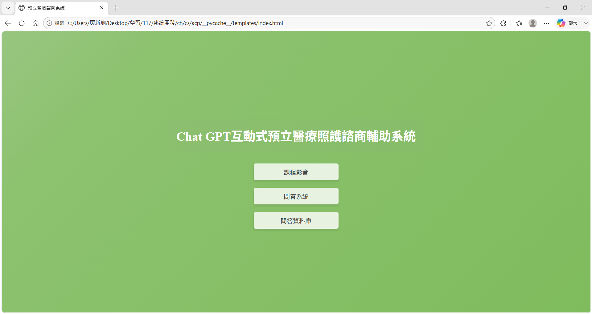
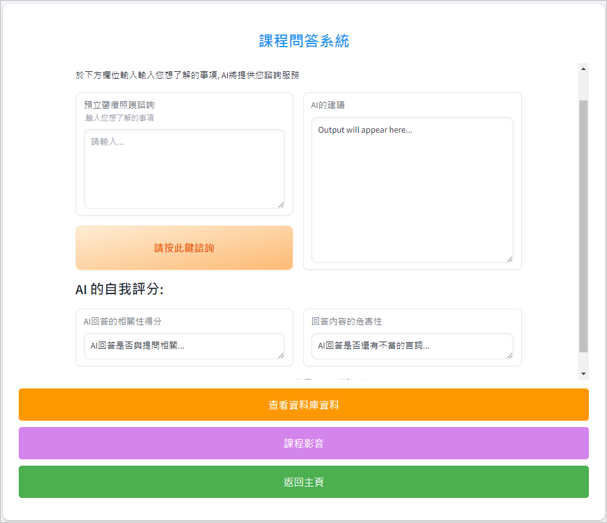
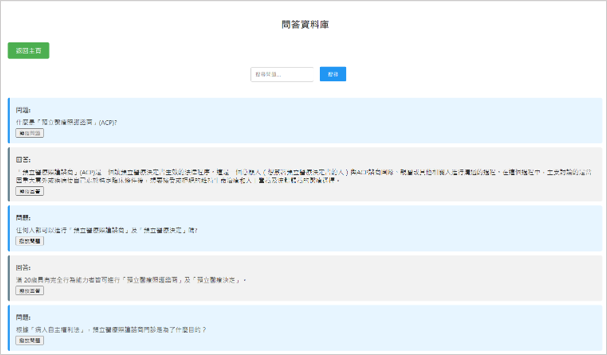
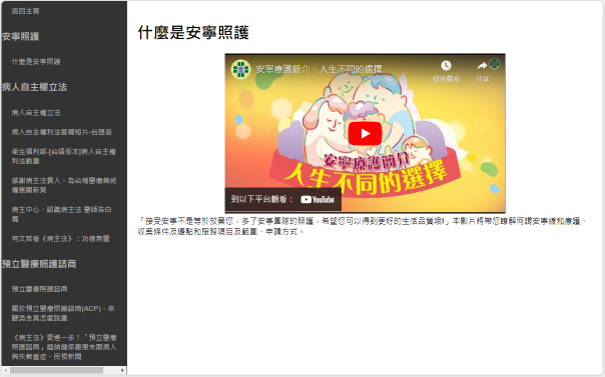

# ACP AI Consultation Platform

AI-powered healthcare consultation platform for Advance Care Planning (ACP).

🎓 Master's Research Project, National Chung Cheng University

📄 Accepted by IEEE COMPSAC 2024 Fast Abstracts

🤖 Built with OpenAI API, LangChain, ChromaDB and Retrieval-Augmented Generation (RAG)

## Overview

ACP AI Consultation Platform is a healthcare-focused conversational AI system designed to support Advance Care Planning (ACP) education and consultation.

The platform integrates Large Language Models (LLMs), Retrieval-Augmented Generation (RAG), healthcare knowledge retrieval, response evaluation, and user feedback mechanisms to improve healthcare information accessibility and user engagement.

## Features

- AI-powered healthcare consultation
- Retrieval-Augmented Generation (RAG)
- Healthcare knowledge retrieval
- Question & Answer database
- Course video learning module
- Conversation history recording
- Response quality evaluation
- User feedback collection

## Tech Stack

### Backend

- Python
- Flask
- SQLAlchemy
- SQLite

### AI

- OpenAI API
- LangChain
- ChromaDB
- HuggingFace Embeddings
- RAG Architecture

### Frontend

- HTML
- CSS
- JavaScript

### Evaluation
- Relevance Evaluation
- Toxicity Evaluation
- Human Feedback Collection

## Architecture

```text
User Query
    │
    ▼
Flask Web Interface
    │
    ▼
Retriever
    │
    ▼
Chroma Vector Database
    │
    ▼
Relevant Documents
    │
    ▼
OpenAI GPT
    │
    ▼
Response Evaluation
    │
    ├── Relevance
    ├── Toxicity
    └── User Feedback
    │
    ▼
QA Record Database
```

## Screenshots

### Home Page



### AI Consultation



### Database Search



### Course Learning Module



## My Contributions

- Designed and developed the complete system architecture
- Built a Flask-based healthcare consultation platform
- Integrated OpenAI GPT and Retrieval-Augmented Generation (RAG)
- Developed healthcare knowledge retrieval workflow
- Implemented response quality evaluation and feedback collection
- Designed database schema and conversation record management

## Technical Challenges

- Managing hallucination risks in healthcare consultation scenarios
- Improving retrieval relevance for ACP knowledge
- Evaluating response quality using relevance and toxicity metrics
- Designing a user-friendly consultation workflow for older adults

## Research Outcome

### Research Topic:

The Impact of a ChatGPT-Based Interactive System on Improving Older Adults’ Knowledge and Attitudes Toward Advance Care Planning

### Publication:

IEEE COMPSAC 2024 Fast Abstracts (Accepted)

## Future Improvements

- Docker Containerization
- Cloud Deployment
- Authentication & User Management
- Citation-based RAG
- Multi-LLM Support
- RESTful API Service
- Monitoring & Logging
